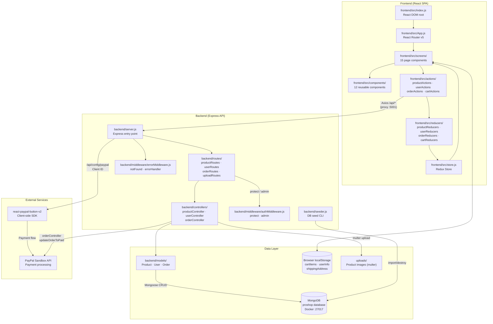
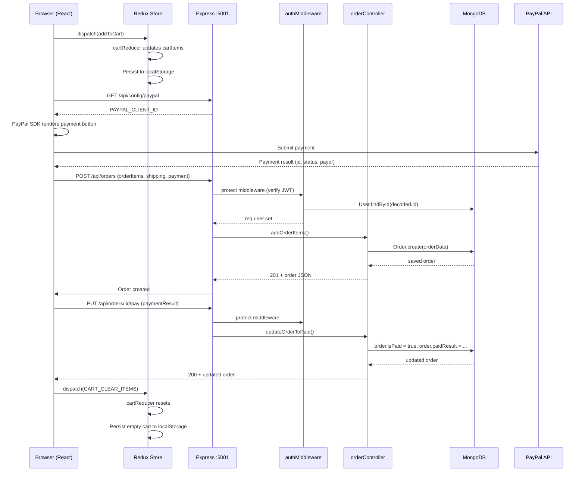

# Architecture — ProShop MERN

## C4 Container Diagram

## Data Flow — Place Order Scenario

## Container Responsibilities

| Container | Path | Role |
|---|---|---|
| React SPA | `frontend/src/` | UI rendering, client-side routing, Redux state management |
| Express API | `backend/server.js` | REST API, JWT auth, file upload, serves static in production |
| MongoDB | Docker `:27017` | Persistent storage for products, users, orders |
| localStorage | Browser | Client-side persistence for cart, auth token, shipping address |
| PayPal Sandbox | External | Payment processing in test mode |
| uploads/ | `uploads/` | Server-side image storage (multer destination) |
