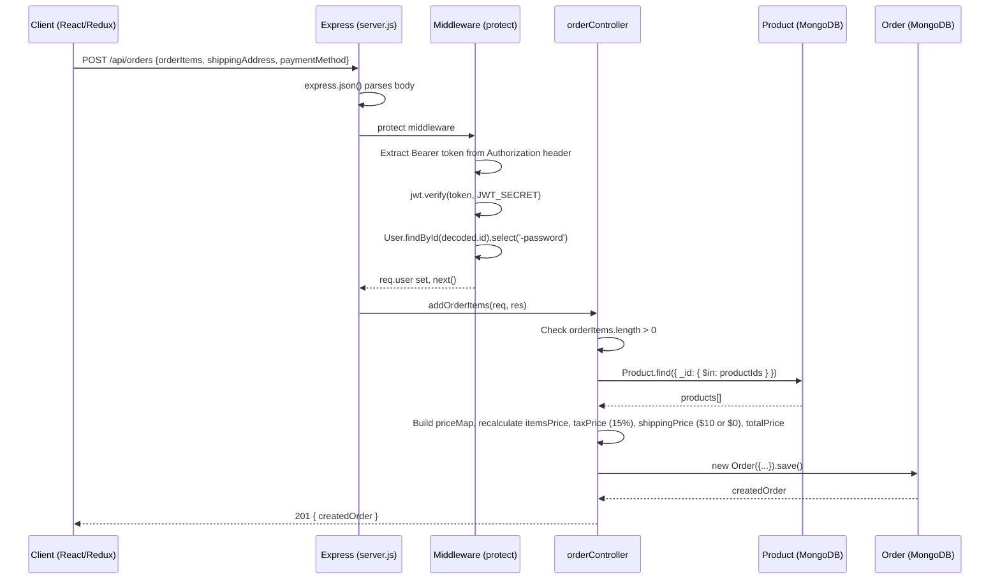
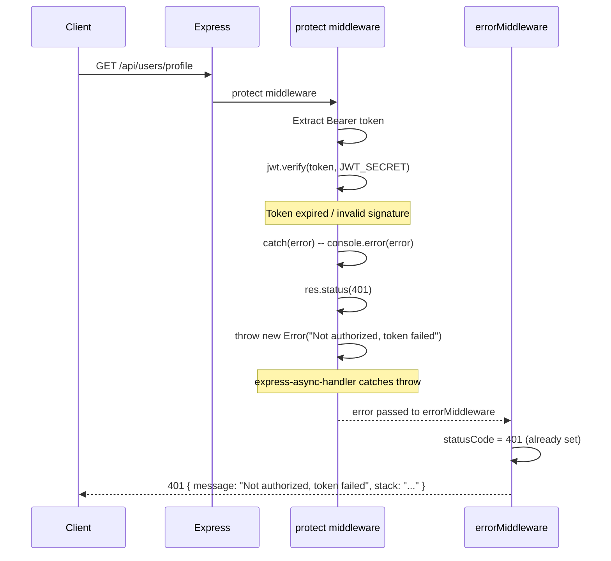
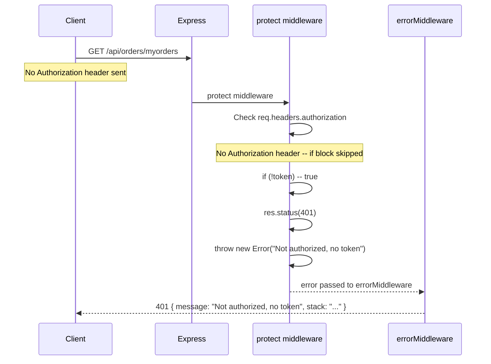

# Backend Module Specification

> Reverse-engineered from source: `backend/` (21 files).
> Stack: Node 16 + Express 4 + Mongoose 5 + JWT + bcryptjs + multer.
> Module system: ES Modules (`"type": "module"`).

---

## Overview

The ProShop backend is a REST API server (Express 4) that serves an eCommerce platform. It exposes 7 route groups mounted under `/api/`, backed by 3 Mongoose models, JWT-based authentication, and file-upload handling.

### Business Logic Summary

**Authentication flow.** Users register (`POST /api/users`) or log in (`POST /api/users/login`). On success, the server returns a JWT (HS256, 30-day expiry) containing `{ id: user._id }`. The `protect` middleware extracts the `Bearer` token from the `Authorization` header, verifies it via `jwt.verify`, loads the user from MongoDB (excluding the password hash), and attaches it to `req.user`. A second middleware, `admin`, checks `req.user.isAdmin` and blocks non-admins with a 401.

**Product catalog.** Products are paginated (10 per page) with optional keyword search via MongoDB `$regex` on the `name` field (case-insensitive). Admins can create placeholder products, then update all fields. Any authenticated user can leave one review per product; the controller enforces uniqueness by checking `r.user.toString() === req.user._id.toString()` against the embedded `reviews` array, then recalculates `rating` (average) and `numReviews` (count) in-place. The `/top` endpoint returns the 3 highest-rated products.

**Order lifecycle.** An authenticated user creates an order by submitting `orderItems`, `shippingAddress`, and `paymentMethod`. The server recalculates all prices from the live Product collection (preventing client-side price manipulation), applies a 15% tax and a $10 shipping fee (waived above $100 total), and saves. Payment confirmation (`PUT /:id/pay`) records the PayPal `paymentResult` object and sets `isPaid`/`paidAt`. Delivery confirmation (`PUT /:id/deliver`) is admin-only. Stock is never decremented on order creation or payment -- there is no inventory reservation.

**Feature flags.** Flags are stored in a flat `features.json` file (not MongoDB). Reads are public; writes (state changes, traffic adjustments) require admin auth. The controller performs synchronous `fs.readFileSync` / `fs.writeFileSync` on every request. Traffic adjustment is only allowed when the flag is in `Testing` state.

**File upload.** A single multer endpoint accepts one image (`upload.single('image')`), validates extension + MIME type against `jpg|jpeg|png`, and writes to `uploads/` with a timestamped filename. No auth middleware is applied to this route despite `protect` being imported.

**n8n proxy.** The `/api/autopilot/feature-control` endpoint proxies POST requests to an external n8n webhook. It uses a custom `nodeFetch` helper (raw `http`/`https` module) instead of a third-party HTTP library. Requires admin auth.

### Data Models

| Model | Key Fields | Sub-documents | Indexes |
|---|---|---|---|
| **User** | name, email (unique), password (bcrypt), isAdmin | -- | `email` (unique via schema) |
| **Product** | name, price, countInStock, rating, numReviews, brand, category, image | `reviews[]` (name, rating, comment, user) | None declared |
| **Order** | user (ref User), orderItems[] (name, qty, image, price, product ref), shippingAddress, paymentMethod, paymentResult, taxPrice, shippingPrice, totalPrice, isPaid, paidAt, isDelivered, deliveredAt | `orderItems[]`, `shippingAddress` (embedded) | None declared |

### Middleware Chain (per request)

```
express.json()          -- parse JSON body
morgan('dev')           -- request logging (development only)
[route-specific]        -- protect, admin (if applicable)
controller (asyncHandler) -- business logic
errorHandler            -- catch-all error response
```

### Complete Endpoint Map

| Method | Path | Auth | Controller |
|---|---|---|---|
| POST | `/api/users/login` | Public | `authUser` |
| POST | `/api/users` | Public | `registerUser` |
| GET | `/api/users/profile` | Private | `getUserProfile` |
| PUT | `/api/users/profile` | Private | `updateUserProfile` |
| GET | `/api/users` | Admin | `getUsers` |
| GET | `/api/users/:id` | Admin | `getUserById` |
| PUT | `/api/users/:id` | Admin | `updateUser` |
| DELETE | `/api/users/:id` | Admin | `deleteUser` |
| GET | `/api/products` | Public | `getProducts` |
| GET | `/api/products/top` | Public | `getTopProducts` |
| GET | `/api/products/:id` | Public | `getProductById` |
| POST | `/api/products` | Admin | `createProduct` |
| PUT | `/api/products/:id` | Admin | `updateProduct` |
| DELETE | `/api/products/:id` | Admin | `deleteProduct` |
| POST | `/api/products/:id/reviews` | Private | `createProductReview` |
| POST | `/api/orders` | Private | `addOrderItems` |
| GET | `/api/orders/myorders` | Private | `getMyOrders` |
| GET | `/api/orders/:id` | Private | `getOrderById` |
| PUT | `/api/orders/:id/pay` | Private | `updateOrderToPaid` |
| PUT | `/api/orders/:id/deliver` | Admin | `updateOrderToDelivered` |
| GET | `/api/orders` | Admin | `getOrders` |
| POST | `/api/upload` | **None** | multer upload |
| GET | `/api/config/paypal` | Public | inline (env var) |
| GET | `/api/feature-flags` | Public | `getFeatureFlags` |
| GET | `/api/feature-flags/descriptions` | Public | `getFeatureFlagDescriptions` |
| GET | `/api/feature-flags/:name` | Public | `getFeatureFlagByName` |
| POST | `/api/feature-flags/:name/state` | Admin | `setFeatureState` |
| POST | `/api/feature-flags/:name/traffic` | Admin | `adjustTrafficRollout` |
| POST | `/api/autopilot/feature-control` | Admin | n8n proxy |

---

## Decision Table

| # | Condition | Then | Else | Edge Case |
|---|-----------|------|------|-----------|
| 1 | `Authorization` header present and starts with `Bearer` | Extract token, verify JWT, load user into `req.user` | Set status 401, throw "Not authorized, no token" | Token is valid JWT but user was deleted from DB -- `req.user` is `null`, downstream controller may crash |
| 2 | JWT verification succeeds | `req.user = await User.findById(decoded.id).select('-password')`; call `next()` | Set status 401, throw "Not authorized, token failed" | Expired token (30-day TTL) triggers the catch branch |
| 3 | `req.user.isAdmin === true` | `admin` middleware calls `next()` | Set status 401, throw "Not authorized as an admin" | `req.user` is `undefined` (protect failed silently) -- `admin` throws TypeError on `undefined.isAdmin`, caught by errorMiddleware as 500 |
| 4 | User registers with existing email | Set status 400, throw "User already exists" | Create user, hash password via pre-save hook, return 201 + JWT | Race condition: two concurrent registrations with same email -- `unique` index throws E11000, caught as generic 500 |
| 5 | Login: email found AND password matches | Return user data + new JWT | Set status 401, throw "Invalid email or password" | `bcrypt.compare` returns falsy for valid user but wrong password |
| 6 | `updateUserProfile` receives new email | Overwrites `user.email` (no uniqueness check at controller level) | Keeps existing email | New email already taken by another user -- Mongoose `unique` index throws E11000, surfaced as 500 |
| 7 | Order has `orderItems.length === 0` | Set status 400, throw "No order items" | Recalculate prices from DB, create order | `orderItems` is `undefined` (falsy) -- the `if (orderItems && ...)` check passes, falls into else branch with `orderItems.map()` throwing TypeError |
| 8 | Product found in DB during order creation | Use server-side price from `product.price` | Throw "Product not found: <id>" | Product deleted between cart load and order submission -- single missing product kills entire order |
| 9 | User already reviewed a product | Set status 400, throw "Product already reviewed" | Append review, recalculate average rating | Concurrent review submission -- both requests pass the `alreadyReviewed` check before either writes, resulting in duplicate reviews |
| 10 | Feature flag name exists in `features.json` | Read/modify the flag object | Set status 404, throw "Feature flag not found" | `features.json` is corrupted or deleted -- `fs.readFileSync` throws ENOENT, caught as generic 500 |
| 11 | Feature flag state set to `Testing` and traffic adjustment requested | Update `traffic_percentage` to requested value | If flag is not `Testing`, set status 400, reject | State is changed from `Testing` to `Enabled` between the read and write -- traffic percentage still gets overwritten |
| 12 | Upload file has valid extension AND valid MIME type | Accept file, write to `uploads/` | Reject with "Images only!" | MIME type spoofing (e.g., `.jpg` extension but `application/x-php` MIME) -- `extname` check passes but `mimetype` check fails; however if both are spoofed, arbitrary files could be stored |
| 13 | `process.env.PAYPAL_CLIENT_ID` is set | Return the value as plain text | Return `undefined` as response body | Missing env var -- client receives string `"undefined"`, may misinterpret as valid config |
| 14 | n8n webhook URL not configured | Set status 500, throw "N8N_WEBHOOK_URL is not configured" | Proxy request to n8n | n8n is down or returns non-JSON -- the `JSON.parse(text)` catch returns `{ success: upstream.ok, message: text }` |
| 15 | `NODE_ENV === 'production'` | Hide error stack in responses (`stack: null`) | Include full stack trace in error JSON | `statusCode` was never explicitly set -- `errorHandler` defaults to 500 if `res.statusCode === 200` |

---

## Sequence Diagram

### Happy Path: Authenticated Order Creation



### Error Path: Auth Failure (Invalid Token)



### Error Path: Missing Token



---

## Edge Cases

### Race Conditions & Concurrency

1. **Duplicate user registration.** Two concurrent `POST /api/users` with the same email both pass `User.findOne({ email })` returning `null`, then both attempt `User.create()`. The Mongoose `unique` index throws `E11000` on the second, which surfaces as a generic 500 error instead of a meaningful 400.

2. **Duplicate product review.** Two concurrent `POST /api/products/:id/reviews` from the same user both check `product.reviews.find(r => r.user.toString() === req.user._id.toString())` and find no match, then both push a review. The product ends up with two reviews from the same user and an incorrect `numReviews` count.

3. **Feature flag write collision.** Two admin requests to `setFeatureState` execute simultaneously. Both read the same `features.json` state, one sets `search_v2` to `Enabled`, the other sets `dark_mode` to `Disabled`. The second write overwrites the first because `fs.writeFileSync` is not atomic with respect to concurrent reads.

4. **Order creation with price change.** A product's price is updated by an admin between the client loading the product page and the user submitting the order. The server recalculates from DB, so the user sees a different total than expected. This is actually the correct defense against price manipulation, but the user gets no warning that prices changed.

5. **Order creation during product deletion.** An admin deletes a product while a user is submitting an order containing that product. `Product.find({ _id: { $in: productIds } })` returns fewer products than expected, the `productMap.get(item.product)` returns `undefined`, and the entire order fails with a generic error.

### Authentication & Authorization

6. **Deleted user with valid JWT.** A user account is deleted via `DELETE /api/users/:id`, but their JWT is still valid for up to 30 days. The `protect` middleware calls `User.findById(decoded.id)` which returns `null`, setting `req.user = null`. Downstream controllers that check `req.user._id` throw a TypeError, which surfaces as a 500 instead of a clean 401.

7. **Admin middleware assumes `req.user` exists.** If `protect` is somehow bypassed or fails without throwing (edge case in middleware ordering), `admin` checks `req.user && req.user.isAdmin`. If `req.user` is `undefined`, the `else` branch fires with status 401. However, if a future developer places `admin` before `protect` in the middleware chain, `req.user` is `undefined` and access is denied rather than crashing -- which is the safer failure mode.

8. **No token revocation mechanism.** JWTs are stateless with no blacklist or rotation. Changing a password does not invalidate existing tokens. The `updateUserProfile` endpoint returns a new token on every PUT, but old tokens remain valid.

9. **Upload route has no auth.** `POST /api/upload` does not apply `protect` or `admin` middleware. Any unauthenticated user can upload files to the server, consuming disk space and potentially uploading malicious content.

10. **User ID in order not validated against requesting user.** `GET /api/orders/:id` is protected but does not verify that `order.user.toString() === req.user._id.toString()`. Any authenticated user can view any order by guessing ObjectIds.

### Data Integrity & Validation

11. **Order itemsPrice not persisted to schema.** The `addOrderItems` controller calculates `itemsPrice` and passes it to `new Order({...})`, but the `orderSchema` does not define an `itemsPrice` field. Mongoose silently drops it. If the frontend depends on `itemsPrice` in the response, it will be missing.

12. **No stock decrement on order.** `countInStock` is never decremented when an order is created or paid. Users can order more items than are in stock, and stock levels are purely cosmetic.

13. **No quantity validation.** `orderItems[].qty` is not validated against `countInStock` or for minimum value (e.g., `qty > 0`). A user could submit an order with `qty: 0` or `qty: -5`.

14. **Review rating not bounded.** The `rating` field in `reviewSchema` accepts any `Number`. A user could submit `rating: 999` or `rating: -1`, corrupting the product's average rating.

15. **Email uniqueness not checked on profile update.** `updateUserProfile` sets `user.email = req.body.email || user.email` without checking if the new email is already taken. The Mongoose `unique` index will throw an E11000 error on save, resulting in a generic 500 error to the client.

16. **Admin can set `isAdmin` on any user.** `updateUser` (admin-only) allows setting `user.isAdmin = req.body.isAdmin`. An admin can promote any user to admin or demote other admins, including themselves, with no confirmation or audit trail.

17. **Self-deletion not prevented.** An admin can delete their own account via `DELETE /api/users/:id`. After deletion, their JWT is still valid for 30 days but `req.user` loads `null` from DB.

### Feature Flag System

18. **Synchronous file I/O in request handlers.** All feature flag endpoints use `fs.readFileSync` and `fs.writeFileSync`, blocking the Node.js event loop. Under concurrent load, this becomes a throughput bottleneck.

19. **No backup/rollback on flag writes.** `setFeatureState` and `adjustTrafficRollout` write directly to `features.json` with no backup. A crash mid-write (e.g., OOM kill) could corrupt the file, leaving all flags in an undefined state.

20. **Traffic percentage not reset on state transition to Testing.** When `setFeatureState` changes state to `Testing`, the code does not explicitly set `traffic_percentage`. If the flag was previously `Enabled` (100%) and moved to `Testing`, traffic stays at 100%, which is likely not the intent for a "testing" state.

21. **Dependencies not enforced.** Feature flags declare `dependencies` (e.g., `semantic_search` depends on `search_v2`), but the backend controller does not validate these when changing state. An admin can enable `photo_reviews` even though `reviews_moderation` is `Disabled`.

### Time & Date Bugs

22. **JWT expiry is 30 days with no refresh.** Tokens expire in 30 days with no refresh mechanism. Users experience sudden logout with no warning. On the flip side, a compromised token remains exploitable for the full 30-day window.

23. **`Date.now()` used for `paidAt` and `deliveredAt`.** These fields use server-local `Date.now()` (which is UTC in Node.js), while the schema defines them as `Date` type. This is correct but inconsistent with the frontend's time zone handling expectations.

24. **Feature flag `last_modified` uses `new Date().toISOString()`.** This is server time (UTC). Some seed flags have `last_modified` as date-only strings (e.g., `"2026-01-15"`) while others have full ISO timestamps. The inconsistency could cause sorting issues in the UI.

### Error Handling & Robustness

25. **`express-async-handler` swallows stack context.** When a controller throws after setting `res.status()`, the error goes to `errorHandler`, which returns the message but the original stack trace is from the throw, not from the controller function name. In production, the stack is hidden entirely (`stack: null`), making debugging harder.

26. **`errorHandler` fallback to 500.** If `res.statusCode === 200` (no status was explicitly set before the error), `errorHandler` assumes 500. This can mask cases where a controller throws before setting a status code, making 500 errors appear that should be 400 or 404.

27. **Multer `checkFileType` calls `cb('Images only!')`.** Passing a string as the first argument to the multer callback triggers multer's error handling, but the error message is not a proper `Error` object. This works but is inconsistent with the rest of the codebase that throws `new Error(...)`.

28. **n8n proxy timeout is 110 seconds.** The default timeout matches the proxy timeout, but if n8n takes longer than 110s, the request is destroyed and a 504 is returned. There is no retry mechanism.

29. **MongoDB connection failure is partially handled.** `server.js` catches the DB connection error and logs a warning, but the server continues running. All DB-dependent endpoints will fail with unhandled Mongoose errors on every request.

30. **`productRoutes.js` route order bug.** The `/top` route is registered AFTER `/:id` in the Express router (lines 15-18 in `productRoutes.js`). Express evaluates routes in registration order, so `GET /api/products/top` matches `getProductById` with `req.params.id = "top"`. The `Product.findById("top")` call will fail with a CastError, caught by asyncHandler as a 500. This is a known gotcha documented in CLAUDE.md but not fixed in code.

---

## Open Questions

1. **Route order for `/top` vs `/:id`.** The `productRoutes.js` file registers `/:id` before `/top`, meaning `GET /api/products/top` will be intercepted by `getProductById`. Is this intentionally left broken because the frontend does not actually call `/top`? Or is the frontend using a cached/top-products endpoint from a different path?

2. **Why no stock management?** Orders never decrement `countInStock`. Is this a deliberate simplification for the learning project, or a known gap that feature flags (`express_checkout`, etc.) are expected to address later?

3. **Feature flags in flat file vs MongoDB.** All other data lives in MongoDB, but feature flags use `features.json` with synchronous file I/O. What is the intended production strategy -- migrate to a `FeatureFlag` model, or keep the file-based approach behind a cache?

4. **No order cancellation.** The order lifecycle goes from created -> paid -> delivered with no cancellation or refund path. Is this intentional for MVP scope?

5. **`itemsPrice` missing from schema.** The controller calculates and passes `itemsPrice` to `new Order()`, but it is not in the schema. Is the frontend handling this client-side, or is this a bug that results in missing data?

6. **Upload endpoint security.** `/api/upload` has no auth middleware. Is this by design (to allow guest image uploads for a future feature) or an oversight?

---

## Suggested Characterization Tests

These tests would pin down the actual observed behavior before any refactoring. Each test is named to describe the specific behavior it characterizes.

| # | Test Name | What It Verifies | Type |
|---|-----------|------------------|------|
| 1 | `auth_login_success_returns_jwt` | POST /api/users/login with valid credentials returns 200 + token with `{ id }` payload | Integration |
| 2 | `auth_login_wrong_password_returns_401` | POST /api/users/login with wrong password returns 401 with message "Invalid email or password" | Integration |
| 3 | `auth_expired_token_returns_401` | Request with expired JWT returns 401 "Not authorized, token failed" | Integration |
| 4 | `auth_deleted_user_token_crashes_500` | Request with valid JWT for a deleted user -- does protect return 401 or does the controller crash with TypeError? | Integration |
| 5 | `register_duplicate_email_returns_400_or_500` | Concurrent or sequential duplicate email registration -- is it 400 or 500? | Integration |
| 6 | `order_price_recalc_ignores_client_prices` | POST /api/orders with manipulated prices -- server recalculates from Product collection | Integration |
| 7 | `order_zero_items_returns_400` | POST /api/orders with `orderItems: []` returns 400 | Integration |
| 8 | `order_undefined_items_behavior` | POST /api/orders with no `orderItems` field -- does it return 400 or throw TypeError? | Integration |
| 9 | `review_duplicate_concurrent_allowed` | Two concurrent review POSTs from same user -- does the product end up with duplicate reviews? | Integration |
| 10 | `product_top_route_matches_id_param` | GET /api/products/top -- returns top products or 500 CastError? (characterizes route order) | Integration |
| 11 | `feature_flag_write_concurrent_overwrites` | Two concurrent state changes to different flags -- does one get lost? | Integration |
| 12 | `feature_flag_testing_state_preserves_traffic` | Set flag to `Enabled` (100%), then set to `Testing` -- is traffic 100% or reset to default? | Integration |
| 13 | `upload_no_auth_accepts_file` | POST /api/upload without Authorization header -- does it succeed? | Integration |
| 14 | `upload_invalid_mime_rejected` | POST /api/upload with `.jpg` extension but non-image MIME -- rejected? | Integration |
| 15 | `order_view_any_user_can_see_any_order` | Authenticated user A requests order belonging to user B -- does it return 200? | Integration |
| 16 | `profile_email_change_to_existing_returns_500` | PUT /api/users/profile with email already taken -- is it 500 (E11000) or handled? | Integration |
| 17 | `paypal_client_id_missing_returns_undefined_string` | GET /api/config/paypal without PAYPAL_CLIENT_ID set -- response body is string "undefined"? | Integration |
| 18 | `admin_self_delete_succeeds` | DELETE /api/users/:id where :id is the admin's own ID -- succeeds? | Integration |
| 19 | `error_handler_defaults_to_500_on_unset_status` | Trigger an error without setting res.status -- does errorMiddleware return 500? | Unit |
| 20 | `bcrypt_pre_save_skips_unmodified` | Update user name without changing password -- password hash is not re-generated | Unit |
