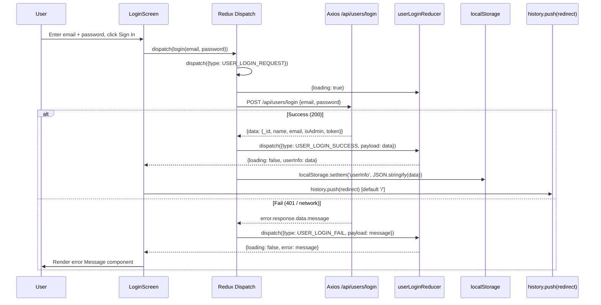
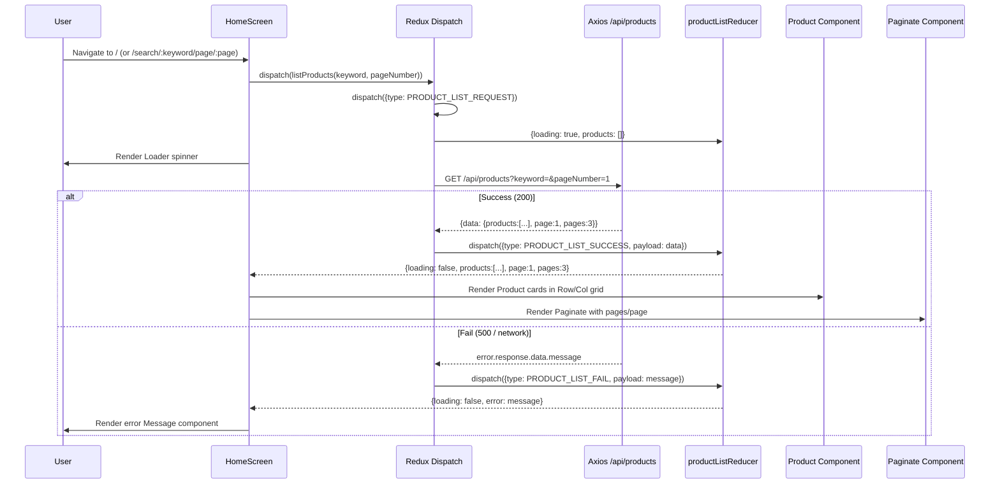
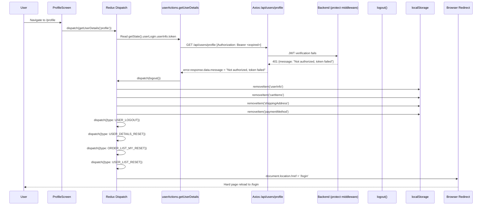

# Frontend Specification -- Reverse-Engineered from Source

> Module: `frontend/src/`
> Stack: React 16 + Redux 4 + Thunk + React-Bootstrap 1 + React Router 5 + Axios
> Generated: 2026-06-08

---

## 1. Overview

### Architecture (~300 words)

The frontend is a single-page application bootstrapped by Create React App (react-scripts 3.4.3, webpack 4). Entry point `index.js` wraps `<App>` in a Redux `<Provider>`. There is no code splitting, no React.lazy, no `<Switch>` wrapper -- all `<Route>` components render simultaneously if their paths match (React Router v5 without `exact` on every route).

**Redux store shape** (`store.js`) combines 22 reducers via `combineReducers`. The top-level state tree is:

```
{
  productList:   { products:[], page, pages, loading, error }
  productDetails:{ product:{reviews:[]}, loading, error }
  productDelete: { loading, success, error }
  productCreate: { product, loading, success, error }
  productUpdate: { product:{}, loading, success, error }
  productReviewCreate: { loading, success, error }
  productTopRated: { products:[], loading, error }
  cart:          { cartItems:[], shippingAddress:{}, paymentMethod }
  userLogin:     { userInfo:{_id,name,email,isAdmin,token} | null }
  userRegister:  { userInfo, loading, error }
  userDetails:   { user:{}, loading, error }
  userUpdateProfile: { userInfo, loading, success, error }
  userList:      { users:[], loading, error }
  userDelete:    { loading, success, error }
  userUpdate:    { user:{}, loading, success, error }
  orderCreate:   { order, loading, success, error }
  orderDetails:  { order, loading:true, error }
  orderPay:      { loading, success, error }
  orderDeliver:  { loading, success, error }
  orderListMy:   { orders:[], loading, error }
  orderList:     { orders:[], loading, error }
  featureFlags:  { flags:{}, loading, error }
}
```

**Persistence**: On store creation, `cart.cartItems`, `userLogin.userInfo`, and `cart.shippingAddress` are hydrated from `localStorage`. Actions that mutate these slices manually call `localStorage.setItem()` after dispatch. The `safeParse` wrapper in `store.js` catches JSON parse errors and falls back to defaults.

**Routing** (`App.js`): Flat `<Route>` list, no guards at route level. Auth protection is enforced inside individual screen components via `useEffect` redirects (e.g., `if (!userInfo) history.push('/login')`). Admin screens check `userInfo && userInfo.isAdmin`.

**Auth flow**: Login/Register dispatch thunks that POST to `/api/users/login` or `/api/users`. On success, the JWT payload (`{_id, name, email, isAdmin, token}`) is stored in Redux state and `localStorage('userInfo')`. All authenticated API calls read `getState().userLogin.userInfo.token` and attach it as `Authorization: Bearer <token>`. When any protected action receives the error string `"Not authorized, token failed"`, it dispatches `logout()` which clears localStorage keys and redirects to `/login` via `document.location.href`.

**API integration pattern**: Every async action follows a strict REQUEST/SUCCESS/FAIL triple. The error extraction pattern is `error.response?.data?.message || error.message`. No Axios interceptors are configured; auth headers are manually attached per-request.

**Cart flow**: Cart state is client-only (no backend cart). Adding to cart fetches the product from the API to get current price/stock, then stores a denormalized `{product, name, image, price, countInStock, qty}` object. Quantity changes replace the entire item via `CART_ADD_ITEM` (same reducer branch handles add and update by checking `existItem`).

---

## 2. Decision Table

| # | Condition | Action / Branch | Source Location |
|---|-----------|-----------------|-----------------|
| D1 | `userInfo` is truthy in Header | Show user dropdown with Profile/Logout | `Header.js:35-49` |
| D2 | `userInfo && userInfo.isAdmin` in Header | Show Admin dropdown (Users, Products, Orders, Features) | `Header.js:51-66` |
| D3 | `userInfo` is truthy on LoginScreen | Redirect to `redirect` param or `/` | `LoginScreen.js:22-24` |
| D4 | `userInfo` is falsy on ProfileScreen | Redirect to `/login` | `ProfileScreen.js:33-34` |
| D5 | `userInfo && userInfo.isAdmin` on UserListScreen | Load user list; else redirect to `/login` | `UserListScreen.js:22-26` |
| D6 | `!userInfo \|\| !userInfo.isAdmin` on ProductListScreen | Redirect to `/login` | `ProductListScreen.js:44-45` |
| D7 | `!userInfo` on OrderScreen | Redirect to `/login` | `OrderScreen.js:50-51` |
| D8 | Product `countInStock > 0` on ProductScreen | Show quantity selector and enabled "Add To Cart" button | `ProductScreen.js:114-135` |
| D9 | `product.countInStock === 0` | Disable "Add To Cart" button | `ProductScreen.js:141-143` |
| D10 | `existItem` found in cart reducer | Replace existing cart item (update qty) | `cartReducers.js:19-23` |
| D11 | No `existItem` in cart reducer | Append new item to cart | `cartReducers.js:26-29` |
| D12 | `!cart.shippingAddress.address` on PlaceOrderScreen | Redirect to `/shipping` | `PlaceOrderScreen.js:16-17` |
| D13 | `!cart.paymentMethod` on PlaceOrderScreen | Redirect to `/payment` | `PlaceOrderScreen.js:18-19` |
| D14 | Order create `success` on PlaceOrderScreen | Redirect to `/order/${order._id}` and reset state | `PlaceOrderScreen.js:41-45` |
| D15 | API error === `"Not authorized, token failed"` | Dispatch `logout()` -- clear all state and localStorage, hard redirect to `/login` | `userActions.js:144-146` and 5 other actions |
| D16 | `!shippingAddress.address` on PaymentScreen | Redirect to `/shipping` | `PaymentScreen.js:12-13` |
| D17 | `userInfo && isAdmin && order.isPaid && !order.isDelivered` on OrderScreen | Show "Mark As Delivered" button | `OrderScreen.js:212-225` |
| D18 | `password !== confirmPassword` on Register/Profile | Show "Passwords do not match" message, do not submit | `RegisterScreen.js:33-34`, `ProfileScreen.js:49-50` |
| D19 | `successCreate` on ProductListScreen | Redirect to edit page for newly created product | `ProductListScreen.js:48-49` |
| D20 | `keyword` present on HomeScreen | Show "Go Back" link instead of carousel | `HomeScreen.js:30-35` |

---

## 3. Sequence Diagrams

### 3.1 Login Flow



### 3.2 Product Listing Flow



### 3.3 Error Path: Expired JWT on Protected Action



---

## 4. Edge Cases

### 4.1 Authentication & Token Issues

| # | Edge Case | Impact | Evidence |
|---|-----------|--------|----------|
| E1 | **Stale/expired JWT in localStorage** | User sees a flash of authenticated UI, then any protected action triggers `logout()` which does a hard redirect. However, public pages (HomeScreen, ProductScreen) render fine with the stale token still in state -- the token is only validated server-side. | `userActions.js:144`, `store.js:68` |
| E2 | **Token present but `isAdmin` undefined** | Admin dropdown does not render (Header checks `userInfo.isAdmin`), but admin routes are still accessible via direct URL -- the screen-level `useEffect` check would redirect, but there is a render cycle before the effect fires. | `Header.js:51`, `UserListScreen.js:22-26` |
| E3 | **logout() uses `document.location.href`** | This is a hard reload, not a React Router navigation. It destroys all in-memory Redux state (which is the intent) but also aborts any pending async operations without cleanup, potentially causing React state-update-on-unmounted warnings. | `userActions.js:74` |
| E4 | **Register auto-logins user** | `register()` dispatches both `USER_REGISTER_SUCCESS` and `USER_LOGIN_SUCCESS`. If registration succeeds but login dispatch fails (impossible in this code path since both use same payload), the `userRegister` state would have `userInfo` but `userLogin` would not. In practice, the `userLogin` slice is set because the same action type is dispatched. | `userActions.js:100-103` |
| E5 | **No token refresh mechanism** | JWT expiry is handled only by the string-match `"Not authorized, token failed"`. If the backend error message changes, the auto-logout silently breaks and the user sees only the error message without being redirected. | `userActions.js:144` |

### 4.2 localStorage & State Corruption

| # | Edge Case | Impact | Evidence |
|---|-----------|--------|----------|
| E6 | **Corrupted `cartItems` in localStorage** | `safeParse` in `store.js` catches JSON.parse errors and falls back to `[]`. However, individual action-level writes (`addToCart` -> `localStorage.setItem`) have no try/catch. If localStorage is full (Safari private mode 5MB limit), `setItem` throws and the action completes in Redux but not in localStorage -- next reload loses the change. | `store.js:58-65`, `cartActions.js:24` |
| E7 | **Missing `cartItems` key** | `safeParse` returns `[]` -- handled correctly. | `store.js:67` |
| E8 | **Missing `userInfo` key** | `safeParse` returns `null` -- user appears logged out. Handled correctly. | `store.js:68` |
| E9 | **XSS via stored data** | Cart items store `name` and `image` from API responses. If a malicious admin creates a product with `<script>` in the name, React's JSX auto-escaping prevents execution. However, `cart.cartItems` is written to localStorage as raw JSON and read back with `JSON.parse` -- no XSS vector there either since React escapes all rendered text. The only risk would be if `dangerouslySetInnerHTML` were used (it is not in current code). | `cartActions.js:14-19`, all screens |
| E10 | **localStorage not available** | `store.js` `safeParse` does not guard against `localStorage` being undefined (e.g., in SSR contexts). It would throw a ReferenceError on store creation. Not an issue in browser-only CRA app. | `store.js:60` |
| E11 | **paymentMethod persisted but not hydrated** | `savePaymentMethod` writes to `localStorage('paymentMethod')` but `store.js` does not read it back on initialization. On page refresh, `cart.paymentMethod` is `undefined`, causing PlaceOrderScreen to redirect to `/payment` even if the user had already selected a method. | `cartActions.js:46-51`, `store.js:71-77` |

### 4.3 Cart Race Conditions & Logic

| # | Edge Case | Impact | Evidence |
|---|-----------|--------|----------|
| E12 | **Rapid double-click "Add To Cart"** | `addToCart` is async (fetches product first). Two dispatches in quick succession both read the old `cartItems` via `getState()`. The second `localStorage.setItem` overwrites the first, but both items are in Redux state (the reducer's `find()` would merge them by `product` ID). localStorage ends up correct because the second `getState()` reflects the first dispatch. However, the `qty` selector on CartScreen dispatches `addToCart` on change -- each change is a separate async call, so rapid dropdown changes could interleave. | `cartActions.js:9-25`, `CartScreen.js:56-60` |
| E13 | **Product price changes after adding to cart** | Cart stores `price` at add time. If admin changes the product price, the cart still shows the old price. The order is submitted with the stale price. Backend does not re-validate prices (assumption -- no price re-check in order creation). | `cartActions.js:14-19` |
| E14 | **Product deleted while in cart** | Cart retains a `{product, name, image, price, countInStock, qty}` snapshot. The item remains in cart with a stale reference. Navigating to `/product/:id` shows a 404 error. No cleanup mechanism exists. | `cartActions.js:14-19` |
| E15 | **countInStock = 0 for cart item** | If `countInStock` was >0 when added but becomes 0 later, the cart still allows the item. The quantity dropdown renders an empty `<select>` (because `[...Array(0).keys()]` is `[]`), which is a visible UI bug. | `CartScreen.js:62` |
| E16 | **Cart clear on order create is async** | `createOrder` dispatches `CART_CLEAR_ITEMS` and then `localStorage.removeItem('cartItems')`. If the localStorage removal fails (quota), the cart appears empty in Redux but reappears on refresh. | `orderActions.js:48-52` |

### 4.4 Routing & Navigation

| # | Edge Case | Impact | Evidence |
|---|-----------|--------|----------|
| E17 | **No `<Switch>` in App.js** | Multiple routes can match simultaneously. E.g., navigating to `/admin/productlist` also matches the catch-all `/:id?` pattern if one existed. In practice, exact routes prevent most collisions, but `/cart/:id?` with no `exact` means `/cart` and `/cart/something` both render CartScreen. | `App.js:29-60` |
| E18 | **CartScreen URL params for add-to-cart** | Navigating to `/cart/:productId?qty=2` triggers `addToCart` in a `useEffect`. If the user bookmarks or shares this URL, every visit re-adds the product. No idempotency guard. | `CartScreen.js:18-21` |
| E19 | **Redirect query param parsing** | `location.search.split('=')[1]` is fragile. A URL like `/login?redirect=/placeorder` works, but `/login?redirect=/page?foo=bar` would parse incorrectly (takes only `/page?foo`). | `LoginScreen.js:19`, `RegisterScreen.js:22` |
| E20 | **Direct URL to admin screens** | Admin screens redirect to `/login` in `useEffect`, but the component renders once before the effect fires. In that single render, admin data may be briefly visible in the DOM (for UserListScreen, an empty table renders; for ProductListScreen, the page dispatches `listProducts` before checking auth). | `ProductListScreen.js:41-51` |

### 4.5 Data & Rendering

| # | Edge Case | Impact | Evidence |
|---|-----------|--------|----------|
| E21 | **Price calculation on PlaceOrderScreen mutates cart state** | `cart.itemsPrice`, `cart.shippingPrice`, `cart.taxPrice`, `cart.totalPrice` are computed by directly mutating the cart object from `useSelector`. This works because the object is a new reference each render, but it is an anti-pattern that could cause issues with React concurrent mode or strict equality checks. | `PlaceOrderScreen.js:26-35` |
| E22 | **OrderScreen recalculates `itemsPrice` by mutating `order`** | Same mutation pattern as E21. `order.itemsPrice` is reassigned inside the render cycle. | `OrderScreen.js:38-47` |
| E23 | **PayPal SDK script injected on every order view** | If `window.paypal` is not found, a new `<script>` tag is appended to `document.body` each time. No cleanup on unmount -- multiple scripts could accumulate if the component remounts. The `onload` callback sets `sdkReady` but the `useEffect` dependency array omits `sdkReady`, so stale closures are possible. | `OrderScreen.js:54-64` |
| E24 | **Product review rating sent as string** | `rating` state is set from `<select>` value which is always a string. The backend may expect a Number. Mongoose might coerce it, but this could cause validation failures. | `ProductScreen.js:183` |
| E25 | **`product._id` check in useEffect** | `ProductScreen` checks `!product._id || product._id !== match.params.id` but on initial load, `product` has default `{reviews:[]}` with no `_id`, triggering a fetch. On subsequent loads with same product, the check prevents re-fetch -- correct. But if the user navigates from one product to another, the old product briefly renders before the new one loads. | `ProductScreen.js:40-43` |
| E26 | **ProductEditScreen upload has no auth header** | `uploadFileHandler` calls `axios.post('/api/upload', formData, config)` without an `Authorization` header. The backend `/api/upload` route requires auth -- this upload would fail with 401 unless Axios is globally configured elsewhere (it is not). | `ProductEditScreen.js:62-69` |
| E27 | **`disabled={cart.cartItems === 0}` on PlaceOrder button** | This compares an array to the number 0, which is always `false`. The button is never disabled. Should be `cart.cartItems.length === 0`. | `PlaceOrderScreen.js:156` |
| E28 | **Duplicate `className` on `<i>` elements** | `UserListScreen.js:63` and `ProfileScreen.js:143,149` have `className='fas fa-check' className='icon-success'` -- JSX uses the last `className`, so the FontAwesome class is silently discarded. Icons may not render. | `UserListScreen.js:63-66` |
| E29 | **No 404 page** | If the user navigates to an unmatched route, nothing renders inside `<main>`. There is no catch-all route or 404 component. | `App.js:29-60` |
| E30 | **`console.log(paymentResult)` left in production** | `OrderScreen.js:80` logs the PayPal payment result object (which contains payer ID, email, and other PII) to the console. | `OrderScreen.js:80` |

---

## 5. Open Questions

1. **Is product price re-validated on order creation?** The frontend sends the client-computed price to `POST /api/orders`. Does the backend recalculate from current product prices, or does it trust the client payload? This determines whether E13 (stale cart price) is a real vulnerability.

2. **What is the JWT expiry duration?** The frontend has no token refresh logic. How long is the token valid? This determines how frequently users hit the expired-token redirect (E1).

3. **Does the backend enforce quantity limits on order creation?** If a user has 1 item in stock but adds qty=5 to cart (by manipulating localStorage or the URL), does the backend reject the order?

4. **Is the PayPal client ID environment-specific?** `GET /api/config/paypal` returns the client ID. Is this the sandbox or production ID? The frontend has no mode indicator.

5. **What happens if two tabs share the same localStorage?** If a user has two browser tabs open, actions in one tab do not update the other tab's Redux state. Logging out in one tab leaves the other tab in a zombie-authenticated state until a protected action triggers the expired-token logout.

6. **Is `CART_CLEAR_ITEMS` constant name mismatch a bug?** In `cartConstants.js`, `CART_CLEAR_ITEMS` is exported as `'CART_RESET'` (value differs from the name). This works because Redux matches on the string value, but it is misleading when debugging.

---

## 6. Suggested Characterization Tests

These tests would lock in the current observed behavior before any refactoring.

### 6.1 Redux Reducer Tests

| Test ID | What it verifies | Key assertion |
|---------|-----------------|---------------|
| CT-01 | `cartReducer` -- add new item | State transitions from `[]` to `[item]`, returns new array reference |
| CT-02 | `cartReducer` -- update existing item qty | Existing item is replaced (same `product` ID), array length stays the same |
| CT-03 | `cartReducer` -- remove item | Item filtered out, other items preserved |
| CT-04 | `cartReducer` -- clear items on order | `cartItems` becomes `[]`, `shippingAddress` preserved |
| CT-05 | `userLoginReducer` -- login success | State becomes `{loading: false, userInfo: payload}` |
| CT-06 | `userLoginReducer` -- logout | State becomes `{}` (empty object, no userInfo) |
| CT-07 | `productListReducer` -- success unpacks pagination | `products`, `pages`, `page` extracted from `action.payload` |
| CT-08 | `orderCreateReducer` -- reset | State returns to `{}` from any state |

### 6.2 Action Creator Tests (with mocked Axios)

| Test ID | What it verifies | Key assertion |
|---------|-----------------|---------------|
| CT-09 | `login()` -- success path | Dispatches REQUEST then SUCCESS, calls `localStorage.setItem('userInfo', ...)` |
| CT-10 | `login()` -- failure path | Dispatches REQUEST then FAIL with server error message |
| CT-11 | `logout()` -- cleanup | Removes 4 localStorage keys, dispatches LOGOUT + 3 RESET actions |
| CT-12 | `addToCart()` -- fetches product then dispatches | Calls `GET /api/products/:id`, then dispatches `CART_ADD_ITEM` with denormalized payload |
| CT-13 | `createOrder()` -- success clears cart | Dispatches `ORDER_CREATE_SUCCESS` then `CART_CLEAR_ITEMS`, removes `cartItems` from localStorage |
| CT-14 | Protected action -- "Not authorized" triggers logout | Any action receiving that error string dispatches `logout()` |

### 6.3 Component Integration Tests

| Test ID | What it verifies | Key assertion |
|---------|-----------------|---------------|
| CT-15 | `LoginScreen` -- redirects when already logged in | If `userInfo` in Redux state, `history.push` is called with redirect |
| CT-16 | `CartScreen` -- adds product from URL params | When rendered with `match.params.id`, dispatches `addToCart` |
| CT-17 | `PlaceOrderScreen` -- redirects without shipping | If no `shippingAddress.address`, redirects to `/shipping` during render |
| CT-18 | `UserListScreen` -- non-admin redirected | If `!userInfo.isAdmin`, `history.push('/login')` called in effect |
| CT-19 | `ProductScreen` -- disabled button when out of stock | Button has `disabled={true}` when `countInStock === 0` |
| CT-20 | `PlaceOrderScreen` -- place order button never disabled | Due to bug E27 (`cart.cartItems === 0` is always false), button is always enabled |

### 6.4 Store Hydration Tests

| Test ID | What it verifies | Key assertion |
|---------|-----------------|---------------|
| CT-21 | Store hydrates `cartItems` from localStorage | Pre-set `localStorage('cartItems')`, create store, assert `cart.cartItems` matches |
| CT-22 | Store hydrates `userInfo` from localStorage | Pre-set `localStorage('userInfo')`, assert `userLogin.userInfo` matches |
| CT-23 | Store handles corrupted localStorage gracefully | Set `localStorage('cartItems')` to `'{invalid json}'`, assert store initializes with `[]` |
| CT-24 | `paymentMethod` not hydrated on refresh | Set `localStorage('paymentMethod')`, assert `cart.paymentMethod` is `undefined` in new store |
