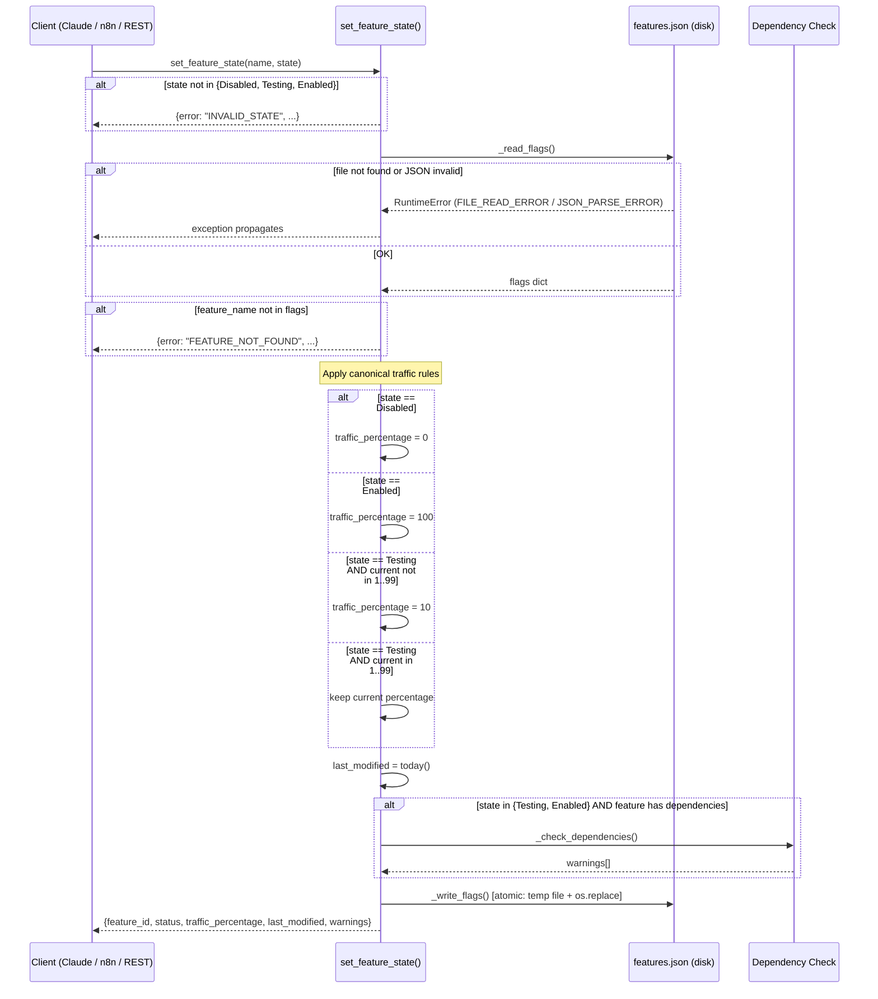
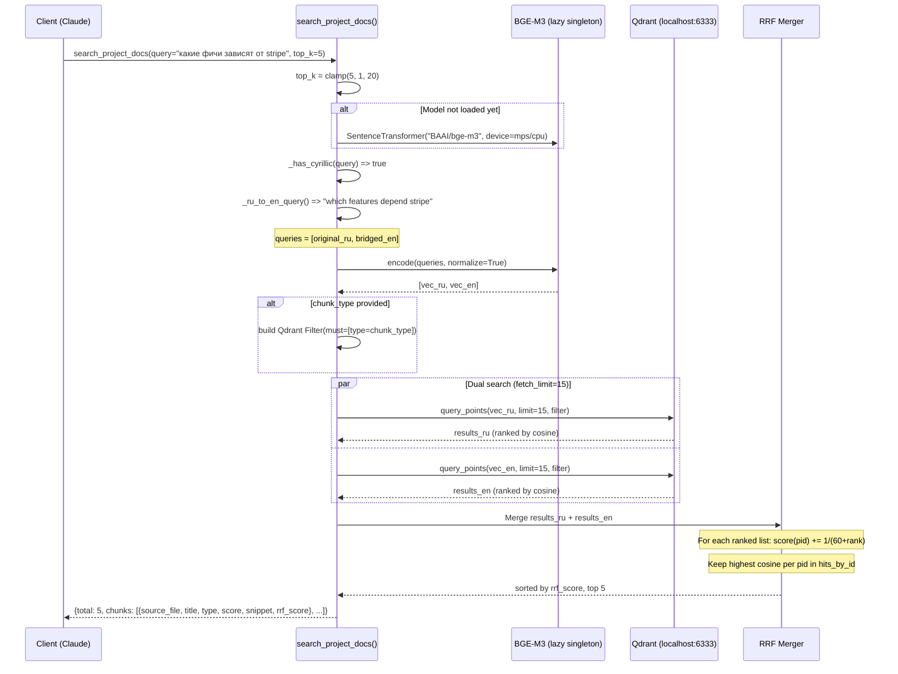

# MCP Servers Specification

> Reverse-engineered from source: `mcp-feature-flags/` (4 files) and `mcp-rag-search/` (2 files).
> Date: 2026-06-08

---

## Overview

### Module 1: mcp-feature-flags

**Purpose:** A Python MCP server (FastMCP) that manages ProShop feature flags stored in `backend/features.json`. It provides four tools — `list_features`, `get_feature_info`, `set_feature_state`, `adjust_traffic_rollout` — for reading and mutating feature flag state. A companion REST API (`rest_api.py`) wraps the same tools behind Starlette HTTP endpoints with X-API-Key auth so that n8n workflows can call them without MCP protocol overhead. A third entry point (`http_server.py`) exposes the MCP tools via streamable-http transport for n8n AI Agent nodes.

**Business Logic:**

The server treats `features.json` as the single source of truth. Every tool call reads the file from disk, and every mutation writes it back atomically (write-to-temp + `os.replace`). Feature flags have three valid states: `Disabled` (traffic=0), `Testing` (traffic=1-99, defaulting to 10), and `Enabled` (traffic=100). State transitions are governed by canonical traffic rules — `set_feature_state` auto-adjusts the percentage while `adjust_traffic_rollout` only works on features already in `Testing`. Dependencies are modeled as a list of feature IDs; when a feature is moved to Testing or Enabled, any non-Enabled dependency triggers a warning (soft constraint, not a block). The REST layer adds auth gating via `x-auth` header (env `MCP_AUTH_SECRET`, defaults to `proshop-secret`) on all POST mutation endpoints, while GET endpoints (`/health`, `/api/features`, `/api/features/:name`, `/api/logs`) are unauthenticated. The logs endpoint reads from `simulators/logs.json` and returns an empty list if the file is missing.

**Key files:** `mcp-feature-flags/server.py` (MCP tools + helpers), `rest_api.py` (Starlette REST wrapper), `http_server.py` (streamable-http MCP transport), `requirements.txt`.

---

### Module 2: mcp-rag-search

**Purpose:** A Python MCP server (FastMCP) that performs semantic vector search over ProShop project documentation. It embeds natural-language queries (English or Russian) using BGE-M3, searches a Qdrant collection (`proshop_chunks`) with cosine similarity, and returns ranked document chunks with metadata.

**Business Logic:**

On first call the server lazily loads the SentenceTransformer model (BAAI/bge-m3) onto the best available device (MPS on Apple Silicon, otherwise CPU) and creates a Qdrant client pointing at `QDRANT_URL` (default `http://localhost:6333`). The single tool `search_project_docs` accepts a query string, an optional `top_k` (clamped 1-20, default 5), and an optional `chunk_type` filter (`adr|api|doc|feature|incident|page|runbook`). For Russian-language queries, the server performs automatic cross-lingual bridging: a token-level dictionary maps ~80 common Russian IT terms to English equivalents, producing a second "English-bridged" query. Both queries are embedded and searched independently, then merged via Reciprocal Rank Fusion (RRF, k=60). Each result is a chunk object containing source_file, file_path, title, parent_headings, type, cosine score, a 200-char snippet, and (for RRF results) an rrf_score. The Qdrant filter uses a `must` clause on the `type` payload field. Results are limited to `top_k * 3` per query before RRF merging.

**Key files:** `mcp-rag-search/server.py` (MCP tool + helpers + lazy singletons), `requirements.txt`.

---

## Decision Table

### mcp-feature-flags

| # | Condition | Action / Outcome |
|---|-----------|-----------------|
| F1 | `state` not in `{Disabled, Testing, Enabled}` | Return `INVALID_STATE` error |
| F2 | `feature_name` not found in `features.json` | Return `FEATURE_NOT_FOUND` error |
| F3 | `set_feature_state` with state=`Disabled` | Set `traffic_percentage=0`, update `last_modified` |
| F4 | `set_feature_state` with state=`Enabled` | Set `traffic_percentage=100`, update `last_modified` |
| F5 | `set_feature_state` with state=`Testing` and current % is 1-99 | Keep current `traffic_percentage`, update `last_modified` |
| F6 | `set_feature_state` with state=`Testing` and current % is 0 or 100 | Set `traffic_percentage=10`, update `last_modified` |
| F7 | Feature has dependencies not in `Enabled` state, target state is `Testing` or `Enabled` | Proceed with state change + return `warnings[]` |
| F8 | `adjust_traffic_rollout` on feature with status != `Testing` | Return `WRONG_STATUS_FOR_ROLLOUT` error |
| F9 | `adjust_traffic_rollout` with `percentage` not int or is bool | Return `INVALID_PERCENTAGE` error |
| F10 | `adjust_traffic_rollout` with `percentage < 0` or `> 100` | Return `INVALID_PERCENTAGE` error |
| F11 | `adjust_traffic_rollout` with `percentage=0` on Testing feature | Set traffic=0, return hint suggesting `set_feature_state("Disabled")` |
| F12 | `adjust_traffic_rollout` with `percentage=100` on Testing feature | Set traffic=100, return hint suggesting promotion to `Enabled` |

### mcp-rag-search

| # | Condition | Action / Outcome |
|---|-----------|-----------------|
| R1 | Query contains Cyrillic characters (`_has_cyrillic`) | Generate bridged English query via `_ru_to_en_query`, run dual search + RRF merge |
| R2 | Query is English-only | Single-query search, return top_k results directly (no RRF) |
| R3 | `chunk_type` is provided and is a valid type string | Apply Qdrant `must` filter on `type` field |
| R4 | `chunk_type` is `None` (default) | No filter applied, search across all types |
| R5 | `top_k < 1` | Clamped to 1 |
| R6 | `top_k > 20` | Clamped to 20 |
| R7 | Bridged English query is empty or identical to original | Skip RRF, use single-query results |
| R8 | Qdrant collection does not exist or connection fails | Exception propagates to caller (unhandled) |
| R9 | Model not yet loaded (first call) | Lazy-init: load BGE-M3 onto MPS if available, else CPU |
| R10 | Chunk text > 200 chars | Truncate snippet to 200 chars + "..." |
| R11 | Chunk text <= 200 chars | Return full text as snippet |
| R12 | RRF merge: same point ID appears in both result sets | Accumulate RRF scores; keep highest cosine score in `hits_by_id` |

---

## Sequence Diagrams

### Diagram 1: mcp-feature-flags — `set_feature_state` flow (most complex tool)

### Diagram 2: mcp-rag-search — `search_project_docs` flow (with Russian query)

---

## Edge Cases

### mcp-feature-flags (15 items)

| # | Edge Case | Current Behavior | Severity |
|---|-----------|-----------------|----------|
| FE1 | `features.json` file deleted between read and write | `_read_flags` raises `RuntimeError(FILE_READ_ERROR)`, unhandled by tools | High |
| FE2 | `features.json` contains invalid JSON | `_read_flags` raises `RuntimeError(JSON_PARSE_ERROR)`, unhandled by tools | High |
| FE3 | Race condition: two concurrent writes to `features.json` | Last write wins; atomic per call but no inter-call locking | Medium |
| FE4 | `percentage=True` passed to `adjust_traffic_rollout` | Explicitly rejected (`isinstance(percentage, bool)` check returns `INVALID_PERCENTAGE`) | Low |
| FE5 | `set_feature_state` called with state=`Testing` and current % = 100 | Resets to 10 (100 is outside 1-99 range) | Medium |
| FE6 | Dependency references a feature ID that does not exist in `features.json` | `_check_dependencies` skips it silently (`dep` is None/Falsey in `if dep and ...`) | Low |
| FE7 | Feature has empty `dependencies` list | No warnings produced, normal flow | None |
| FE8 | `adjust_traffic_rollout` sets percentage=0 on Testing feature | Allowed, with hint to use `set_feature_state("Disabled")` instead | Low |
| FE9 | `adjust_traffic_rollout` sets percentage=100 on Testing feature | Allowed, with hint to promote to `Enabled` | Low |
| FE10 | REST API called without `x-auth` header on POST endpoints | Returns 401 `UNAUTHORIZED` | None (expected) |
| FE11 | REST API GET endpoints have no auth check | `/health`, `/api/features`, `/api/features/:name`, `/api/logs` are all unauthenticated | Medium |
| FE12 | `simulators/logs.json` missing when `/api/logs` is called | Returns `{total: 0, logs: []}` | None (graceful) |
| FE13 | `FEATURES_JSON_PATH` env var points to non-existent file | `_read_flags` raises `FILE_READ_ERROR` on first tool call | Medium |
| FE14 | `MCP_AUTH_SECRET` left at default value `proshop-secret` | Security risk: anyone who knows the default can mutate flags | High |
| FE15 | Atomic write fails (disk full, permissions) | Temp file cleaned up, `RuntimeError(FILE_WRITE_ERROR)` raised | High |

### mcp-rag-search (15 items)

| # | Edge Case | Current Behavior | Severity |
|---|-----------|-----------------|----------|
| RE1 | Qdrant not running at `QDRANT_URL` | `QdrantClient.__init__` succeeds (lazy), fails on first `query_points` with unhandled exception | High |
| RE2 | Collection `proshop_chunks` does not exist in Qdrant | `query_points` raises exception, unhandled | High |
| RE3 | `top_k=0` passed | Clamped to 1 (`max(1, min(20, 0))`) | None |
| RE4 | `top_k=100` passed | Clamped to 20 | None |
| RE5 | Query is empty string `""` | Embedding produced, Qdrant search executed, likely returns random/low-score results | Medium |
| RE6 | Russian query where all tokens are in dictionary and no Latin tokens remain | Bridged query is empty string `""`; condition `en_query != query` is true, so dual search runs with one empty embedding | Medium |
| RE7 | `chunk_type` value not matching any documents (e.g., `"nonexistent"`) | Qdrant returns empty results, tool returns `{total: 0, chunks: []}` | None |
| RE8 | BGE-M3 model download on first run (no cache) | First call blocks for minutes while model downloads; no timeout or progress feedback | Medium |
| RE9 | MPS device selected but CUDA-only model op | `PYTORCH_ENABLE_MPS_FALLBACK=1` set at module level as mitigation | Low |
| RE10 | Very short query (1 char, e.g., `"a"`) | Normal flow, low-quality results expected | Low |
| RE11 | Payload missing expected fields (`text`, `source_file`, etc.) | `_point_to_chunk` uses `.get()` with empty-string defaults; snippet logic works on empty string | Low |
| RE12 | Two queries return same point ID | RRF scores accumulated; highest cosine score kept in `hits_by_id` | None (correct) |
| RE13 | `fetch_limit = top_k * 3` produces fewer results than `top_k` | RRF returns fewer than `top_k` chunks; `total` reflects actual count | None |
| RE14 | Russian token partially matches dictionary (e.g., `"фича!"` with punctuation) | `strip(".,!?;:")` in `_ru_to_en_query` handles trailing punctuation; but leading punctuation not stripped | Low |
| RE15 | `_model` and `_client` are module-level globals | Not thread-safe; concurrent calls could trigger double initialization (unlikely in MCP single-call model but possible in REST wrapper) | Low |

---

## Open Questions

1. **No schema validation on `features.json` contents.** The server assumes every value in the dict has `status`, `traffic_percentage`, `name`, `dependencies` fields. If a flag entry is malformed (e.g., missing `traffic_percentage`), `set_feature_state` will raise `KeyError` at runtime. Should there be a JSON schema validator?

2. **REST API auth is hardcoded to header name `x-auth`.** The `rest_api.py` uses `request.headers.get("x-auth", "")` rather than the standard `Authorization` header. This is non-standard and may confuse API consumers.

3. **`list_features` has no auth on REST but exposes all flag names and statuses.** Is this intentional? The Express backend's `GET /api/feature-flags` also reads the same file publicly.

4. **RAG search has no result caching.** Every call re-embeds the query and hits Qdrant. For repeated queries this is expensive (BGE-M3 inference). Should an LRU cache be added?

5. **Russian-English dictionary is static and incomplete.** Only ~80 mappings cover common IT terms. Domain-specific terms (e.g., "webhook", "middleware", "seed") are not covered. Should the dictionary be externalized or replaced with a translation API?

6. **`_ru_to_en_query` discards unrecognized Cyrillic tokens entirely.** A query like "как работает middleware" becomes "how middleware" (losing "middleware" if it were Cyrillic, or keeping it if Latin). This is intentional but may surprise users who mix scripts.

7. **No pagination in `list_features` or `search_project_docs`.** For `list_features` this is fine (typically <50 flags). For RAG search with `top_k=20`, the response can be large but is bounded.

8. **`http_server.py` and `rest_api.py` share port 5150 by default.** Running both simultaneously causes a port conflict. Are they meant to be mutually exclusive entry points?

9. **`last_modified` format inconsistency.** `set_feature_state` uses `date.today().isoformat()` (e.g., `"2026-06-08"`) but existing entries in `features.json` use ISO 8601 with time (e.g., `"2026-06-02T15:40:24.806Z"`). The format is not validated.

---

## Suggested Characterization Tests

### mcp-feature-flags

| # | Test Name | Input | Expected Outcome |
|---|-----------|-------|-----------------|
| CT1 | `set_feature_state` invalid state | `state="Live"` | `{error: "INVALID_STATE"}` |
| CT2 | `set_feature_state` nonexistent feature | `feature_name="xyz"` | `{error: "FEATURE_NOT_FOUND"}` |
| CT3 | `set_feature_state` Enabled on valid feature | `feature_name="save_for_later", state="Enabled"` | `traffic_percentage=100, status="Enabled"` |
| CT4 | `set_feature_state` Testing with current=100 | feature with `traffic_percentage=100`, `state="Testing"` | `traffic_percentage` resets to `10` |
| CT5 | `set_feature_state` Testing with current=50 | feature with `traffic_percentage=50`, `state="Testing"` | `traffic_percentage` stays `50` |
| CT6 | `set_feature_state` with unmet dependency | `semantic_search` to Testing while `search_v2` is Disabled | State changes + `warnings` list non-empty |
| CT7 | `adjust_traffic_rollout` on Disabled feature | feature status=`Disabled` | `{error: "WRONG_STATUS_FOR_ROLLOUT"}` |
| CT8 | `adjust_traffic_rollout` percentage=True | `percentage=True` | `{error: "INVALID_PERCENTAGE"}` |
| CT9 | `adjust_traffic_rollout` percentage=0 on Testing | Testing feature, `percentage=0` | `traffic_percentage=0` + hint about `Disabled` |
| CT10 | `adjust_traffic_rollout` percentage=100 on Testing | Testing feature, `percentage=100` | `traffic_percentage=100` + hint about `Enabled` |
| CT11 | `list_features` returns all | (no args) | `{total: N, features: [...]}` where N matches file |
| CT12 | `get_feature_info` nonexistent | `feature_name="nope"` | `{error: "FEATURE_NOT_FOUND"}` |
| CT13 | Atomic write survives concurrent read | Read file immediately after `set_feature_state` | File is valid JSON (no partial writes) |
| CT14 | REST POST without auth | POST `/api/features/x/state` without `x-auth` | HTTP 401 |

### mcp-rag-search

| # | Test Name | Input | Expected Outcome |
|---|-----------|-------|-----------------|
| CT15 | English query basic | `query="checkout incident"` | Returns chunks with `type="incident"` ranked highly |
| CT16 | Russian query triggers bridging | `query="какие фичи зависят от stripe"` | Dual query executed, RRF merge, `rrf_score` present in results |
| CT17 | `top_k` clamped low | `top_k=0` | Treated as `top_k=1`, returns at most 1 chunk |
| CT18 | `top_k` clamped high | `top_k=999` | Treated as `top_k=20` |
| CT19 | `chunk_type` filter | `query="auth", chunk_type="adr"` | Only chunks with `type="adr"` returned |
| CT20 | Empty result set | `query="xyznonexistent123", chunk_type="runbook"` | `{total: 0, chunks: []}` |
| CT21 | Cyrillic query with no dictionary matches | `query="абвгдеж"` | Bridged query is `""`, dual search runs, results are low-quality |
| CT22 | Snippet truncation | Any query returning chunk with text > 200 chars | `snippet` ends with `"..."` |
| CT23 | Qdrant unreachable | `QDRANT_URL=http://localhost:99999` | Exception raised (unhandled), tool fails |
