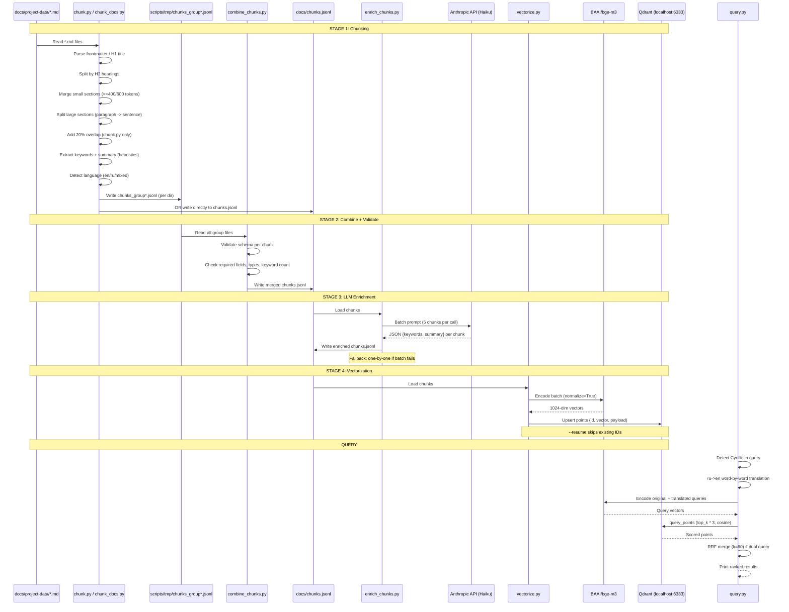
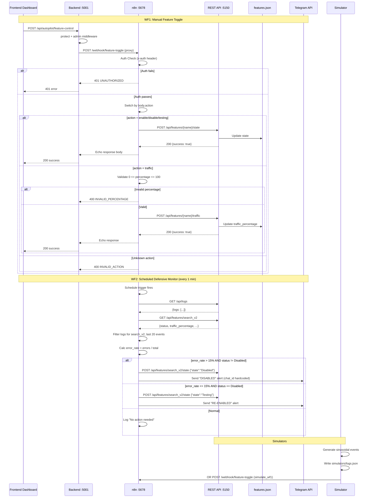

# Pipeline & n8n Automation Specification

> Reverse-engineered from `scripts/` and `n8n-workflows/` + `simulators/`.
> Generated: 2026-06-08

---

## Overview

### Module 1: Data Pipeline (`scripts/`)

A 4-stage offline pipeline that converts the project's markdown documentation corpus
(`docs/project-data/*.md`) into a searchable vector index stored in Qdrant. The pipeline
produces chunks with rich metadata (keywords, summary, type, language, heading breadcrumbs)
and encodes them with BGE-M3 (1024-dim) for semantic retrieval.

**Flow**: `chunk.py` / `chunk_docs.py` -> `combine_chunks.py` -> `enrich_chunks.py` -> `vectorize.py`

1. **chunk.py** -- Splits markdown files by H2 sections, merges consecutive small sections
   up to ~400 tokens, and falls back to paragraph/sentence splitting for oversized sections.
   Adds 20% overlap when splitting mid-section. Extracts keywords/summary via frequency heuristics.
   Outputs a single `docs/chunks.jsonl`.

2. **chunk_docs.py** -- Alternative chunker with a more sophisticated strategy: H2/H3 heading
   hierarchy parsing, section grouping by H2 boundaries, orphan pre-H2 content merging,
   post-processing merge of tiny chunks (<40 tokens), and bilingual token estimation
   (Cyrillic chars/3, Latin chars/4). Uses a larger stop-word list including Russian.
   Outputs to the same `docs/chunks.jsonl`.

3. **combine_chunks.py** -- Merges per-group JSONL files from `scripts/tmp/chunks_group*.jsonl`
   into a single `docs/chunks.jsonl`. Validates each chunk against a strict schema: required
   fields (text, metadata), required metadata fields (source_file, file_path, title,
   parent_headings, type, keywords, summary, language, chunk_index), valid types (adr, api,
   feature, runbook, incident, page, doc), valid languages (en, ru, mixed), keyword count
   3-10, summary max 300 chars. Reports stats by type/language/source file.

4. **enrich_chunks.py** -- Calls Anthropic Claude Haiku to replace heuristic keywords/summary
   with LLM-quality ones. Processes chunks in configurable batches (default 5) via a single
   multi-chunk prompt. Falls back to one-by-one processing if the batch call fails. Requires
   `ANTHROPIC_API_KEY` env var. Saves progress every 10 chunks in one-by-one mode.

5. **vectorize.py** -- Loads `docs/chunks.jsonl`, encodes chunk text with `BAAI/bge-m3`
   (1024-dim, cosine distance), and upserts into Qdrant collection `proshop_chunks` at
   `localhost:6333`. Supports `--recreate` (drop+rebuild), `--resume` (skip already-indexed
   chunks by scrolling existing point IDs), MPS auto-detection with CPU fallback on OOM,
   and configurable batch size (auto-reduced to 8 on MPS). Overwrites by default.

6. **query.py** -- CLI search tool. Embeds a query with BGE-M3, searches Qdrant for top-K
   chunks via cosine similarity. Supports payload pre-filtering by `type` and `source_file`.
   Cross-lingual: Russian queries are word-by-word translated to English via a local
   `_RU_EN` dictionary (~100 entries). Both original and translated vectors are searched,
   results merged via Reciprocal Rank Fusion (RRF, k=60) so chunks ranked high by both
   queries win. Includes `--test` mode with 3 predefined queries.

### Module 2: n8n Automation (`n8n-workflows/` + `simulators/`)

Two n8n workflows that automate feature flag management, backed by a REST API
(`mcp-feature-flags/rest_api.py` on port 5150) and a ProShop backend proxy
(`/api/autopilot/feature-control`).

**WF1 -- Manual Feature Toggle**: A webhook-triggered workflow that accepts POST requests
with `{feature_name, action, [traffic_percentage]}`. Authenticates via `x-auth` header
against a hardcoded secret (`proshop-secret`). Routes by action (enable/disable/testing/traffic)
using a Switch node. The `traffic` action validates percentage is a number in [0,100] before
calling the REST API. Invalid actions and out-of-range percentages are rejected with 400 errors
_before_ any API call (algorithm-before-AI pattern). The frontend can also call the backend
proxy (`autopilotRoutes.js`) which forwards to the n8n webhook, or fall back to calling the
REST API directly if n8n is down.

**WF2 -- Scheduled Defensive Monitor**: A cron-triggered workflow (every 1 minute) that
polls `GET /api/logs` and `GET /api/features/search_v2`, calculates the error rate from the
last 20 events for the `search_v2` feature, and auto-toggles based on a 15% threshold. If
error_rate > 15% and feature is not Disabled -> POST disable + Telegram alert. If error_rate
<= 15% and feature is Disabled -> POST re-enable (set Testing) + Telegram alert. Otherwise
no action. Telegram alerts are sent with hardcoded bot token and chat ID.

**Simulators**: `traffic_simulator.py` generates sinusoidal traffic logs to `simulators/logs.json`.
`threshold_test.py` validates the full auto-toggle cycle (dry-run or live). `simulate_wf1.py`
dispatches WF1 webhook requests on a timer with cycling actions and optional invalid payloads
(guardrail testing, every 7th request sends percentage=-50).

---

## Decision Table

### Data Pipeline Conditionals

| # | Condition | Source | Decision / Branch | Effect |
|---|-----------|--------|-------------------|--------|
| D1 | `tok(body) <= MAX_TOKENS` (400 in chunk.py, 800 in chunk_docs.py) | chunk.py:243, chunk_docs.py:366 | Whole file fits | Emit single chunk, skip section splitting |
| D2 | `tok(candidate) <= max_tokens` during section merge | chunk.py:146, chunk_docs.py:315 | Section fits in buffer | Accumulate into current buffer |
| D3 | `tok(content) > max_tokens` for a single section | chunk.py:155 | Oversized single section | Emit as-is (split_large_text handles later) |
| D4 | `len(parts) > 1` after splitting large text | chunk.py:259 | Multiple sub-chunks produced | Apply 20% overlap via `add_overlap()` |
| D5 | Cyrillic ratio > 0.3 of total chars | chunk_docs.py:28 | Russian-heavy text | Token estimate = chars/3 (vs chars/4 for English) |
| D6 | Cyrillic count > Latin count | chunk.py:108 | Language detection | `detect_language` returns "ru" vs "en" |
| D7 | Has Cyrillic AND Latin | chunk_docs.py:37 | Mixed script | `detect_language` returns "mixed" |
| D8 | `estimate_tokens(chunk) < 40` in post-processing | chunk_docs.py:405 | Tiny chunk detected | Merge with next chunk, re-extract keywords/summary |
| D9 | Batch API call fails in enrich_chunks.py | enrich_chunks.py:176 | Batch enrichment error | Fall back to one-by-one enrichment |
| D10 | `text.startswith("```")` in enrich response | enrich_chunks.py:86,129 | LLM wrapped JSON in code fence | Strip code fence before JSON parse |
| D11 | `--recreate` flag | vectorize.py:116 | Force rebuild | `client.recreate_collection()` drops all data |
| D12 | `--resume` flag + collection exists | vectorize.py:130 | Resume interrupted indexing | Scroll existing point IDs, skip already-uploaded chunks |
| D13 | `all(bid in skip_ids)` for a batch | vectorize.py:159 | Entire batch already indexed | Skip batch entirely |
| D14 | MPS OOM during encoding | vectorize.py:187 | Out of memory on Apple Silicon | Reload model on CPU, retry batch |
| D15 | `_has_cyrillic(query)` in query.py | query.py:178 | Russian query detected | Build translated English query, run dual search, merge via RRF |

### n8n Automation Conditionals

| # | Condition | Source | Decision / Branch | Effect |
|---|-----------|--------|-------------------|--------|
| N1 | `$headers['x-auth'] == "proshop-secret"` | wf1, Auth Check node | Valid auth | Proceed to Switch Action |
| N2 | `$headers['x-auth'] != "proshop-secret"` | wf1, Auth Check node | Invalid/missing auth | Respond 401 UNAUTHORIZED |
| N3 | `body.action == "enable"` | wf1, Switch node output 0 | Enable request | POST `{"state":"Enabled"}` to REST API |
| N4 | `body.action == "disable"` | wf1, Switch node output 1 | Disable request | POST `{"state":"Disabled"}` to REST API |
| N5 | `body.action == "testing"` | wf1, Switch node output 2 | Testing request | POST `{"state":"Testing"}` to REST API |
| N6 | `body.action == "traffic"` | wf1, Switch node output 3 | Traffic request | Proceed to Traffic % Valid? check |
| N7 | `typeof traffic_percentage == "number" AND 0 <= pct <= 100` | wf1, Traffic % Valid? node | Valid percentage | POST `{"percentage": N}` to REST API |
| N8 | `typeof traffic_percentage != "number" OR pct < 0 OR pct > 100` | wf1, Traffic % Valid? node (false branch) | Invalid percentage | Respond 400 INVALID_PERCENTAGE |
| N9 | `body.action` not in {enable, disable, testing, traffic} | wf1, Switch node fallback output 4 | Unknown action | Respond 400 INVALID_ACTION |
| N10 | `total >= 5 AND errorRate > 0.15 AND status != "Disabled"` | wf2, Calc Error Rate code node | Error spike detected | Action = "disable" |
| N11 | `total >= 5 AND errorRate <= 0.15 AND status == "Disabled"` | wf2, Calc Error Rate code node | Error rate recovered | Action = "enable" (set Testing) |
| N12 | `total < 5 OR (errorRate in normal range)` | wf2, Calc Error Rate code node | No threshold crossing | Action = "none" (log only) |
| N13 | `n8n is unreachable` from frontend | autopilotRoutes.js:67 | Upstream timeout/connection error | Backend responds 502 or 504, frontend falls back to direct REST API call |
| N14 | `iteration % 7 == 0` in simulate_wf1.py | simulate_wf1.py:61 | Guardrail test tick | Send invalid payload: `percentage=-50, action="rollout"` |
| N15 | `max_rate <= threshold` in threshold_test.py | threshold_test.py:119 | Threshold unreachable | Print warning: "Will never disable" |

---

## Sequence Diagrams

### 1. Data Pipeline Flow



### 2. n8n Webhook Flow (WF1 + WF2)



---

## Edge Cases

### Data Pipeline Edge Cases

| # | Edge Case | Source | Current Behavior | Risk / Gap |
|---|-----------|--------|------------------|------------|
| E1 | Empty markdown file (0 bytes or whitespace only) | chunk.py:232, chunk_docs.py:354 | Returns empty list `[]` | No chunk emitted -- file silently dropped |
| E2 | File with only an H1 heading, no body | chunk.py:243 | `tok(body) <= MAX_TOKENS` is true for empty body, emits chunk with empty text | Chunk with empty or near-empty text pollutes index |
| E3 | Single paragraph > 400 tokens (no paragraph break) | chunk.py:185-186 | `_split_sentences()` splits on `.!?` boundaries | If no sentence-ending punctuation exists, returns entire text as one chunk |
| E4 | Overlap produces chunk > MAX_TOKENS | chunk.py:216-227 | Overlap is appended as `tail + "\n\n" + chunk[i]` | Combined text can exceed MAX_TOKENS since overlap is not re-checked |
| E5 | Cyrillic text with >30% ratio but mixed content | chunk_docs.py:28 | `estimate_tokens` uses chars/3 | Underestimates tokens for mixed-language chunks with technical English terms |
| E6 | Frontmatter parsing: malformed YAML (no colon) | chunk.py:76-80 | Lines without `:` are silently skipped | Metadata fields like `type` may be missing, defaulting to heuristic inference |
| E7 | JSONL line with trailing whitespace or BOM | combine_chunks.py:88 | `line.strip()` handles whitespace | BOM characters survive strip, can cause JSON parse failure |
| E8 | Keywords fewer than 3 or more than 10 after enrichment | combine_chunks.py:59-62 | Validation warns but does not drop the chunk | Malformed chunks pass through to vectorization |
| E9 | Summary > 300 chars after enrichment | combine_chunks.py:64-65 | Validation warns only | Long summaries stored in Qdrant payload, increasing memory |
| E10 | Anthropic API returns non-JSON (hallucinated prose) | enrich_chunks.py:88 | `json.loads` raises, batch fails | Falls back to one-by-one, but if API consistently returns bad format, all chunks keep heuristic metadata |
| E11 | Qdrant not running at vectorization time | vectorize.py:109 | `QdrantClient` connection fails with unhandled exception | Script crashes; `--resume` can restart from last successful batch |
| E12 | MPS device available but model incompatible | vectorize.py:78-79 | `PYTORCH_ENABLE_MPS_FALLBACK=1` set | Some operations silently fall back to CPU within PyTorch; batch may be slower than expected |
| E13 | Duplicate chunk IDs on re-run without `--recreate` | vectorize.py:132-133 | Upsert overwrites existing points by default | Safe, but no warning that data is being replaced |
| E14 | Query with only stop-words or very short text | query.py:162 | Embeds near-empty string, returns low-quality results | No minimum query length check |
| E15 | Russian query with words not in `_RU_EN` dictionary | query.py:117-119 | Unmatched Russian words are dropped entirely | English-only translation may be too short or misleading for embedding |

### n8n Automation Edge Cases

| # | Edge Case | Source | Current Behavior | Risk / Gap |
|---|-----------|--------|------------------|------------|
| E16 | n8n webhook receives GET instead of POST | wf1 Webhook node | `httpMethod: "POST"` configured | n8n returns 405 Method Not Allowed automatically |
| E17 | `x-auth` header is missing entirely | wf1 Auth Check | `$headers['x-auth']` is undefined | IF node evaluates undefined != "proshop-secret" -> false branch -> 401. Correct. |
| E18 | `body.action` is null or undefined | wf1 Switch node | Falls to fallback output 4 | Returns 400 INVALID_ACTION. Correct. |
| E19 | `traffic_percentage` is a string "50" instead of number | wf1 Traffic % Valid? | `typeof "50"` is "string", not "number" | Rejected with 400 INVALID_PERCENTAGE (strict type check). Correct. |
| E20 | `traffic_percentage` is exactly 0 or exactly 100 | wf1 Traffic % Valid? | `>= 0` and `<= 100` operators | Both pass validation. Correct. |
| E21 | `feature_name` does not exist in features.json | wf1 HTTP Request | POST to REST API with unknown feature name | REST API returns 404; n8n does not handle this specially, passes raw response to "Respond Success" |
| E22 | REST API (port 5150) is down when n8n calls it | wf1 HTTP Request nodes | n8n HTTP Request node throws connection error | Workflow execution fails; webhook never responds -> client timeout |
| E23 | WF2 fires but `/api/logs` returns empty array | wf2 Calc Error Rate | `featureLogs` is empty, `total=0`, `errorRate=0`, `action="none"` | Correct: no action taken when no data available |
| E24 | WF2: exactly 5 events, all errors -> errorRate = 100% | wf2 Calc Error Rate | `total >= 5` and `errorRate (100%) > 0.15` | Feature disabled. Correct, but 5 is a small sample -- may be overly aggressive |
| E25 | WF2: feature already Disabled, error rate stays high | wf2 Calc Error Rate | `status == "Disabled"` -> condition `status != "Disabled"` is false | No repeated disable call. Correct: idempotent. |
| E26 | Telegram bot token is invalid or revoked | wf2 Alert Disabled/Restored | HTTP Request to Telegram API fails | n8n execution fails on that branch; disable/re-enable already happened, but no alert sent |
| E27 | `simulate_wf1.py` sends `action="rollout"` | simulate_wf1.py:54 | Not in {enable, disable, testing, traffic} | WF1 Switch falls to fallback -> 400 INVALID_ACTION. Simulator uses different action names than WF1 expects. |
| E28 | `simulate_wf1.py` sends `X-API-Key` header | simulate_wf1.py:38 | WF1 checks `x-auth` (lowercase) | If n8n normalizes headers case-insensitively, auth passes. If not, 401. |
| E29 | `threshold_test.py --live` but REST API is down | threshold_test.py:65-85 | `requests.post` throws `ConnectionError` | `call_mcp` catches exception, returns `{success: False}`, test continues |
| E30 | Multiple WF2 instances running simultaneously | wf2 cron trigger | Both poll logs, both calculate same error rate, both toggle | Race condition: double disable or disable+immediate re-enable possible |

---

## Open Questions

1. **chunk.py vs chunk_docs.py**: Two alternative chunkers exist with different strategies and thresholds (400 vs 800 token whole-file cutoff, overlap vs no overlap). Which is canonical? They write to the same output file, so running both sequentially would overwrite.

2. **Hardcoded secrets**: `x-auth: proshop-secret` in WF1 and WF2, Telegram bot token and chat ID in WF2 are hardcoded in JSON. These should be n8n credentials or environment variables.

3. **WF2 hardcoded feature**: `search_v2` is hardcoded in the Calc Error Rate code node. To monitor other features, the workflow JSON must be edited manually.

4. **Minimum events threshold (5)**: WF2 requires at least 5 events before taking action. During low-traffic periods, the monitor may never trigger even if all events are errors.

5. **No idempotency guard on WF1**: If the frontend retries a toggle request (network timeout), the same state change is applied twice. The REST API is stateful but has no request deduplication.

6. **RRF k=60 tuning**: The RRF constant in query.py is set to 60 without documented justification. For small result sets this may over-penalize chunks that only appear in one result list.

7. **`combine_chunks.py` is never called in documented flow**: The README and CLAUDE.md do not mention it. It may be dead code from a parallel-chunking experiment.

8. **Simulator action name mismatch**: `simulate_wf1.py` uses `action="rollout"` and `action="rollback"` which are not valid WF1 actions. This simulator cannot successfully drive WF1.

9. **Token estimation accuracy**: `chars / 3.5` (chunk.py) and `chars / 3` or `chars / 4` (chunk_docs.py) are rough heuristics. No validation against actual BGE-M3 tokenizer output.

10. **No cleanup/re-index strategy**: When docs change, the entire pipeline must be re-run with `--recreate`. There is no incremental update mechanism.

---

## Suggested Characterization Tests

Tests that lock in the _current_ behavior (not desired behavior), making future refactoring safer.

### Data Pipeline

| # | Test Name | What It Locks In |
|---|-----------|-----------------|
| CT1 | `test_empty_file_produces_no_chunks` | Empty .md yields empty list |
| CT2 | `test_small_file_single_chunk` | File under threshold (400/800 tokens) produces exactly 1 chunk |
| CT3 | `test_h2_split_boundaries` | H2 headings create chunk boundaries; text before first H2 is merged with first H2 group |
| CT4 | `test_overlap_appended` | `add_overlap()` appends tail of previous chunk to next chunk |
| CT5 | `test_language_detection_en_ru_mixed` | Pure English -> "en", pure Russian -> "ru", mixed -> "mixed" (chunk_docs.py) or by majority (chunk.py) |
| CT6 | `test_cyrillic_token_estimate` | Text with >30% Cyrillic uses chars/3, otherwise chars/4 |
| CT7 | `test_keywords_max_8` | `extract_keywords` returns at most 8 keywords |
| CT8 | `test_summary_first_sentence` | Summary is first sentence 20-250 chars or first 150 chars as fallback |
| CT9 | `test_combine_validates_schema` | combine_chunks.py rejects chunks missing required fields, wrong types, bad keyword counts |
| CT10 | `test_vectorize_upsert_overwrites` | Running vectorize.py twice without `--recreate` overwrites existing points without error |

### n8n Automation

| # | Test Name | What It Locks In |
|---|-----------|-----------------|
| CT11 | `test_wf1_missing_auth_returns_401` | POST without x-auth header -> 401 UNAUTHORIZED |
| CT12 | `test_wf1_invalid_action_returns_400` | action="foobar" -> 400 INVALID_ACTION |
| CT13 | `test_wf1_traffic_string_pct_returns_400` | traffic_percentage="50" (string) -> 400 INVALID_PERCENTAGE |
| CT14 | `test_wf1_traffic_negative_returns_400` | traffic_percentage=-50 -> 400 INVALID_PERCENTAGE |
| CT15 | `test_wf1_traffic_0_and_100_accepted` | Both boundary values pass the IF node |
| CT16 | `test_wf2_no_logs_no_action` | Empty logs array -> action="none" |
| CT17 | `test_wf2_below_5_events_no_action` | 4 events, all errors -> total < 5 -> action="none" |
| CT18 | `test_wf2_high_error_disables` | 20 events, 4 errors (20%) -> errorRate > 15% -> action="disable" |
| CT19 | `test_wf2_already_disabled_no_double_disable` | status="Disabled", high error rate -> condition `status != "Disabled"` is false -> action="none" |
| CT20 | `test_wf2_recovery_reenables_as_testing` | status="Disabled", low error rate -> action="enable" (POST sets Testing, not Enabled) |
| CT21 | `test_simulator_sin_wave_range` | error_rate oscillates within [base-amplitude, base+amplitude] clamped to [0,1] |
| CT22 | `test_threshold_test_detects_full_cycle` | With amplitude > threshold > base_rate, both enable and disable transitions occur |
| CT23 | `test_proxy_timeout_returns_504` | Backend proxy to n8n times out -> frontend receives 504 |
| CT24 | `test_guardrail_invalid_pct_in_simulator` | simulate_wf1.py sends percentage=-50 on every 7th iteration -> WF1 rejects with 400 |
